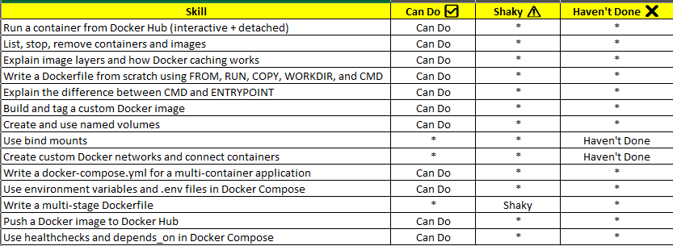
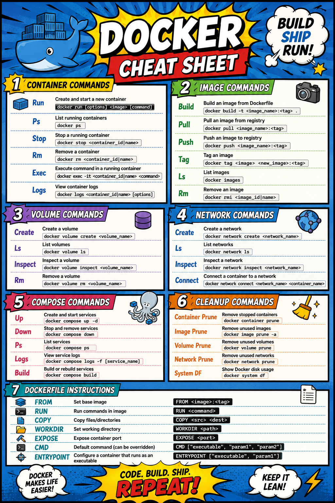

### TASK 1

### TASK 2

Quick-Fire Questions
Answer from memory, then verify:

What is the difference between an image and a container?
Image is a blueprint of an application and Container is a where an application is running.

What happens to data inside a container when you remove it?
Data gets deleted when container is removed.

How do two containers on the same custom network communicate?
Containers on the same custom Docker network communicate using container names as hostnames

What does docker compose down -v do differently from docker compose down?
It removes volumes along with containers and networks

Why are multi-stage builds useful?
Multi-stage builds allow us to separate the build and runtime stages, resulting in smaller, more secure, and optimized Docker images

What is the difference between COPY and ADD?
COPY only copies files and directories into the image, whereas ADD can also extract archives and fetch files from URLs.

What does -p 8080:80 mean?
-p 8080:80 maps host port 8080 to container port 80

How do you check how much disk space Docker is using?
docker system df to check how much disk space Docker is using

### TASK -3

