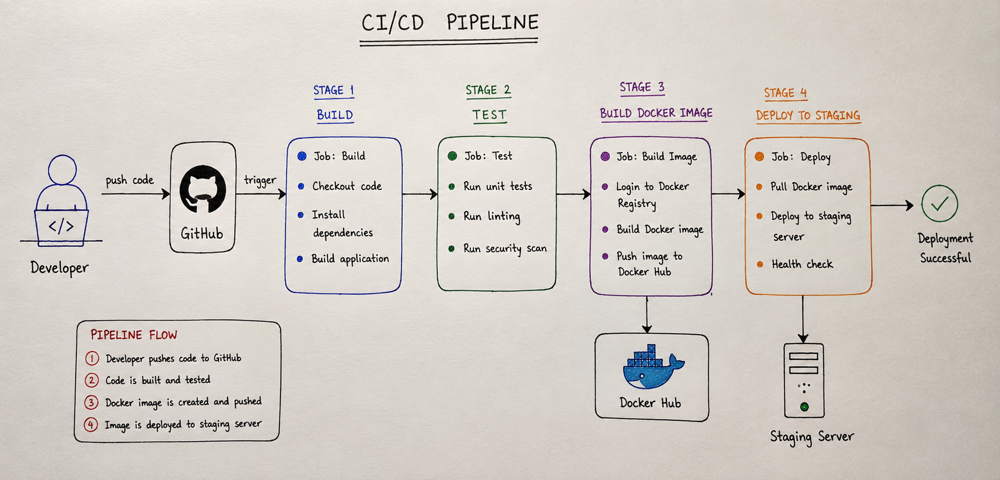

## Task 1: The Problem

### What Can Go Wrong?

If 5 developers are working on the same project and deploying manually, many things can go wrong. Two developers might change the same file and create conflicts. Someone could deploy the wrong version of the application or forget to include important files. Bugs may reach production because testing is done manually. Fixing mistakes can also take a lot of time.

### What Does "It Works on My Machine" Mean?

"It works on my machine" means the application runs fine on a developer's computer but does not work on another machine or on the production server. This happens because the environments are different, such as different software versions, libraries, or settings.

This is a real problem because users do not use the developer's computer. The application must work correctly in every environment.

### How Many Times a Day Can a Team Safely Deploy Manually?

A team can usually deploy manually only a few times a day, around 1 to 3 times. Manual deployments take time and there is always a chance of human error. As the team grows, manual deployments become difficult to manage, which is why companies use CI/CD pipelines.

## Task 2: CI vs CD

### Continuous Integration (CI)

Continuous Integration is the practice of frequently merging code changes into a shared repository. Whenever developers push code, automated builds and tests run to check for errors. It helps catch bugs and integration issues early.

**Example:** A developer pushes code to GitHub, and GitHub Actions automatically runs tests to verify the code.

---

### Continuous Delivery (CD)

Continuous Delivery extends CI by making sure the application is always ready for release. After the build and tests pass, the application is packaged and prepared for deployment, but a person still decides when to deploy it.

**Example:** An e-commerce company automatically builds and tests its application, but the release manager manually approves deployment to production.

---

### Continuous Deployment

Continuous Deployment goes one step further than Continuous Delivery. If all tests pass successfully, the application is automatically deployed to production without any manual approval.

**Example:** A company like Netflix can automatically deploy small code changes to production after all automated tests pass.

## Task 3: Pipeline Anatomy

### Trigger

A trigger is the event that starts a pipeline. Common triggers include pushing code to a repository, creating a pull request, or running the pipeline manually.

**Example:** A developer pushes code to GitHub.

---

### Stage

A stage is a major phase of the pipeline. Pipelines are usually divided into stages such as Build, Test, and Deploy.

**Example:** Build Stage compiles the application.

---

### Job

A job is a group of related tasks that run within a stage. A stage can contain one or more jobs.

**Example:** A Test Stage may contain a job that runs unit tests.

---

### Step

A step is a single action or command inside a job. Jobs are made up of multiple steps executed one after another.

**Example:** `npm install` or `docker build .`

---

### Runner

A runner is the machine that executes the jobs in a pipeline. It can be a cloud-hosted machine or a self-hosted server.

**Example:** GitHub Runner or Azure DevOps Agent.

---

### Artifact

An artifact is a file or package produced by a job that can be used later in the pipeline or deployment process.

**Example:** A Docker image, ZIP file, or build package.

### TASK 4 

### TASK 5

Task 5: Explore in the Wild
Repository

FastAPI GitHub Repository

Workflow File

Add to Project

What Triggers It?

This workflow runs when:

A pull request is created or updated (pull_request_target)
An issue is opened
An issue is reopened
How Many Jobs Does It Have?

The workflow has 1 job:

add-to-project

What Does It Do?

This workflow automatically adds newly created issues and pull requests to the FastAPI GitHub Project board.

It uses a GitHub Action called actions/add-to-project and authenticates using a GitHub token. This helps maintainers organize and track issues and pull requests without doing it manually.

Summary
Trigger: Pull requests, opened issues, reopened issues
Jobs: 1
Purpose: Automatically add issues and pull requests to the FastAPI project board for better project management.

